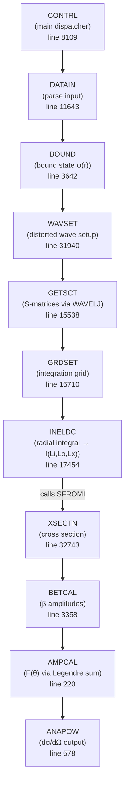
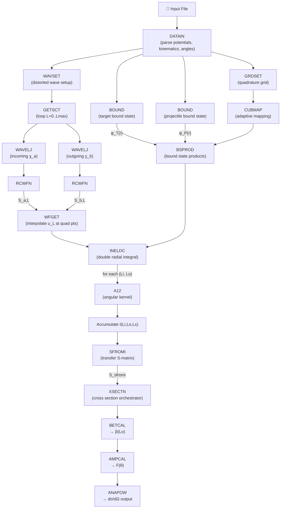

# Ptolemy Subroutine Map & Mathematical Reference

> **Active test case:** 16O(d,p)17O at Elab=20 MeV
> **Source:** `src/source.mor`, `src/rcwfn.f`, `src/fortlib.mor`
> **Last updated:** 2026-03-29

---

## Table of Contents

1. [High-Level Flow](#1-high-level-flow)
2. [Subroutine Reference](#2-subroutine-reference)
3. [Data Flow Diagram](#3-data-flow-diagram)
4. [Mathematical Reference](#4-mathematical-reference)
5. [Physics Constants](#5-physics-constants)

---

## 1. High-Level Flow



---

## 2. Subroutine Reference

### CONTRL — Main Dispatcher
**Fortran line:** 8109 | **C++:** [`dwba.cpp`](../src/dwba/dwba.cpp) | Sequences the entire calculation via `IGOTO` state machine.

| IGOTO | Action |
|-------|--------|
| 1 | Call BOUND |
| 5 | Call WAVSET |
| 7 | Call INELDC |
| 9 | Call XSECTN |

### DATAIN — Input Parser
**Fortran line:** 11643 | **C++:** [`PtolemyParser.cpp`](../src/input/PtolemyParser.cpp), [`PtolemyParser.h`](../include/PtolemyParser.h) | Reads input file, parses OMP parameters, kinematics, bound state params, angular range. Stores everything in COMMON blocks (Fortran) / `DWBA` struct (C++).

### BOUND — Bound State Wavefunction
**Fortran line:** 3642 | **C++:** [`bound.cpp`](../src/dwba/bound.cpp) | Solves Schrödinger equation with WS + SO potential using Numerov. Performs depth search (adjusts V until BE matches). Stores φ(r) = u(r)/r where ∫u²dr = 1.

### WAVSET — Distorted Wave Setup
**Fortran line:** 31940 | **C++:** [`setup.cpp`](../src/dwba/setup.cpp) | Allocates memory, initializes grid parameters (step size H, NSTEP). Calls WAVELJ via WFGET for each partial wave L.

### WAVELJ — Distorted Wave Solver
**Fortran line:** 30428 | **C++:** [`wavelj.cpp`](../src/dwba/wavelj.cpp) | Computes u_L(r) = r·χ_L(r) for a single partial wave using modified Numerov. Matches to Coulomb functions at large r. Extracts S-matrix via Wronskian.

**Key detail:** Stores u_L(r) = r·χ_L(r), NOT χ_L(r) directly.

### RCWFN — Coulomb Wave Functions
**Fortran file:** `src/rcwfn.f` | **C++:** [`rcwfn.cpp`](../src/dwba/rcwfn.cpp), [`rcwfn.h`](../include/rcwfn.h) | Computes regular (F_L) and irregular (G_L) Coulomb wave functions using Steed's method + continued fractions.

### WFGET — Wavefunction Retrieval
**Fortran line:** 32533 | **C++:** integrated into [`grdset_ineldc_faithful.cpp`](../src/dwba/grdset_ineldc_faithful.cpp) | Interpolates precomputed distorted wave u_L(r) at Gauss quadrature points. Returns u_L(r) = r·χ_L(r).

### GETSCT — S-Matrix Loop
**Fortran line:** 15538 | **C++:** [`wavelj.cpp`](../src/dwba/wavelj.cpp) (loop in [`dwba.cpp`](../src/dwba/dwba.cpp)) | Loops L from 0 to L_max, calls WAVELJ for each, stores S-matrix.

### GRDSET — Integration Grid Setup
**Fortran line:** 15710 | **C++:** [`grdset_ineldc_faithful.cpp`](../src/dwba/grdset_ineldc_faithful.cpp) | Sets up Gauss quadrature for 2D radial integral. Uses CUBMAP for adaptive point distribution. Calls BSPROD to evaluate bound state overlaps.

### BSPROD — Bound State Product Evaluator
**Fortran line:** 4531 | **C++:** integrated into [`grdset_ineldc_faithful.cpp`](../src/dwba/grdset_ineldc_faithful.cpp) | Evaluates wavefunction products at grid points via Lagrange interpolation (AITLAG).

| ITYPE | Computes |
|-------|---------|
| 1 | Full interp, NO chi — returns FP×FT only |
| 2 | Flat-top clipping, NO chi — returns FP×FT |
| ≥3 | Same as ITYPE-2, THEN multiplies R×chi(RA) × R×chi(RB) |

### INELDC — Main DWBA Radial Integral
**Fortran line:** 17454 | **C++:** [`grdset_ineldc_faithful.cpp`](../src/dwba/grdset_ineldc_faithful.cpp) | Double integration over (r_i, r_o) with angular kernel. Calls SFROMI after integration.

### A12 — Angular Coupling Kernel
**Fortran line:** 1453 | **C++:** [`a12.cpp`](../src/dwba/a12.cpp) | Computes angular momentum transformation coefficient for DWBA transfer kernel.

### SFROMI — Transfer S-Matrix Assembly
**Fortran line:** 29003 | **C++:** [`xsectn.cpp`](../src/dwba/xsectn.cpp) | Converts raw radial integral I(Li,Lo,Lx) into S-matrix element with kinematic factor, spectroscopic amplitudes, phases, and 9-J symbols.

### BETCAL — Beta Amplitude Calculator
**Fortran line:** 3358 | **C++:** [`xsectn.cpp`](../src/dwba/xsectn.cpp) | Computes angle-independent β(Lo) amplitudes from S_sfromi elements.

### AMPCAL — Angular Distribution
**Fortran line:** 220 | **C++:** [`xsectn.cpp`](../src/dwba/xsectn.cpp) | Sums β(Lo) × P_Lo^Mx(cosθ) at each angle. Calls PLMSUB for Legendre polynomials.

### XSECTN — Cross Section Orchestrator
**Fortran line:** 32743 | **C++:** [`xsectn.cpp`](../src/dwba/xsectn.cpp) | Calls BETCAL → AMPCAL → ANAPOW. Applies final prefactor and ×10 fm²→mb conversion.

### ANAPOW — Output
**Fortran line:** 578 | **C++:** [`xsectn.cpp`](../src/dwba/xsectn.cpp) | Formats and prints dσ/dΩ vs angle table. Also computes analyzing powers if requested.

### ELDCS — Elastic Cross Section
**Fortran line:** 12989 | **C++:** [`elastic.cpp`](../src/elastic/elastic.cpp), [`elastic.h`](../include/elastic.h) | Computes elastic dσ/dΩ from optical model S-matrix (separate from transfer).

### Math Utilities
**C++:** [`math_utils.cpp`](../src/dwba/math_utils.cpp), [`math_utils.h`](../include/math_utils.h) | Clebsch-Gordan, Racah W, 6-J, 9-J symbols, Wigner 3-J.

### AV18 Potential
**C++:** [`av18_potential.cpp`](../src/dwba/av18_potential.cpp), [`av18_potential.h`](../include/av18_potential.h) | AV18 deuteron wavefunction and spectroscopic amplitude.

### Isotope Database
**C++:** [`Isotope.cpp`](../src/input/Isotope.cpp), [`Isotope.h`](../include/Isotope.h) | Nuclear masses, charges, binding energies, Q-values.

### Optical Model Potentials
**C++:** [`potential_eval.cpp`](../src/dwba/potential_eval.cpp), [`potential_eval.h`](../include/potential_eval.h), [`Potentials.cpp`](../src/input/Potentials.cpp) | Woods-Saxon potential evaluation and parameterizations.

### Spline Interpolation
**C++:** [`spline.cpp`](../src/dwba/spline.cpp), [`spline.h`](../include/spline.h) | Cubic spline interpolation for wavefunction grids.

---

## 3. Data Flow Diagram



---

## 4. Mathematical Reference

### 4.1 Kinematics

The reaction is A(a,b)B. For 16O(d,p)17O at Elab=20 MeV:

$$
E_\text{cm}^\text{(a)} = E_\text{lab} \cdot \frac{M_A}{M_a + M_A}
$$

$$
E_\text{cm}^\text{(b)} = E_\text{cm}^\text{(a)} + Q - E_x
$$

Wave numbers:

$$
k = \sqrt{2\mu E_\text{cm} / \hbar^2}
$$

Sommerfeld parameters:

$$
\eta = \frac{Z_1 Z_2 e^2 \mu}{\hbar^2 k}
$$

### 4.2 Optical Model Potentials

**General Woods-Saxon form:**

$$
U(r) = -V f(r) - i W_V f(r) + i W_S \frac{df}{dr} + V_\text{SO} \frac{1}{r}\frac{df}{dr} \; \mathbf{L}\cdot\mathbf{S} + V_C(r)
$$

where the Woods-Saxon form factor is:

$$
f(r, R, a) = \left[1 + \exp\left(\frac{r - R}{a}\right)\right]^{-1}, \quad R = r_0 \, A^{1/3}
$$

**Coulomb potential** (uniform sphere):

$$
V_C(r) = \begin{cases}
\dfrac{Z_1 Z_2 e^2}{2R_C}\left(3 - \dfrac{r^2}{R_C^2}\right) & r \leq R_C \\[8pt]
\dfrac{Z_1 Z_2 e^2}{r} & r > R_C
\end{cases}
$$

### 4.3 Coulomb Phases

$$
\sigma_L = \arg\!\left[\Gamma(L+1+i\eta)\right] = \sum_{n=1}^{L} \arctan\!\left(\frac{\eta}{n}\right)
$$

### 4.4 SFROMI Formula

$$
S_\text{SFROMI} = \text{FACTOR} \cdot \text{ATERM} \cdot \frac{i^{L_i+L_o+2L_x+1}}{\sqrt{2L_i+1}} \cdot I(L_i, L_o, L_x)
$$

**FACTOR:**

$$
\text{FACTOR} = 2\sqrt{\frac{k_a \, k_b}{E_\text{cm}^\text{(a)} \; E_\text{cm}^\text{(b)}}}
$$

**ATERM** (spectroscopic × angular momentum coupling):

$$
\text{ATERM}(L_x) = \sqrt{\frac{J'_B+1}{J'_A+1}} \cdot \sqrt{2L_x+1} \cdot S_\text{proj}^{1/2} \cdot S_\text{targ}^{1/2} \cdot W(l_T, j_T, l_P, j_P; j_x, L_x)
$$

Here J'\_A and J'\_B are doubled nuclear spins (Ptolemy convention: J'=2J), and W is the Racah coefficient.

### 4.5 BETCAL Formula

$$
\beta(L_o, L_x, M_x) = \frac{1}{2k_a} \sum_{L_i} (2L_i+1) \cdot C(L_i, 0, L_x, M_x; L_o, M_x) \cdot e^{i(\sigma_{L_i} + \sigma_{L_o})} \cdot S_\text{SFROMI}
$$

### 4.6 Cross Section Formula

$$
\frac{d\sigma}{d\Omega}(\theta) = 10 \cdot \sum_{L_x, M_x} f_{M_x} \cdot \left|\sum_{L_o} \beta(L_o, M_x) \cdot P_{L_o}^{M_x}(\cos\theta)\right|^{2}
$$

### 4.7 Angular Coupling (A12)

$$
A_{12} = \sum_{M_T, M_U} C(M_T, M_U) \cos(M_T \phi_T - M_U \phi_\text{ab})
$$

where each coefficient C is:

$$
C(M_T, M_U) = X_N \cdot d^{l_T}_{|M_T|,0}(\pi/2) \cdot d^{l_P}_{0,0}(\pi/2) \cdot
\begin{pmatrix} l_T & l_P & L_x \\
M_T & 0 & -M_T \end{pmatrix}
\cdot d^{L_i}_{|M_U|,0} \cdot d^{L_o}_{|M_T-M_U|,0} \cdot \sqrt{2L_o+1} \cdot
\begin{pmatrix} L_i & L_o & L_x \\
M_U & M_T-M_U & -M_T \end{pmatrix}
$$

with the normalization:

$$
X_N = \tfrac{1}{2}\sqrt{(2L_i+1)(2l_T+1)(2l_P+1)}
$$

### 4.8 CUBMAP Quadrature

**Rational-sinh formula (MAPTYP=2):** Given Gauss-Legendre nodes t\_k on [-1,1]:

$$
x_k = \frac{-A + (C/\gamma)\sinh(\tau \, t_k)}{B - (D/\gamma)\sinh(\tau \, t_k)}, \quad \tau = \text{arcsinh}(\gamma)
$$

Points concentrate near x\_mid.

---

## 5. Physics Constants

### 5.1 Reference Values (16O(d,p)17O, Elab=20 MeV, ground state)

```
Q-value:     1.9185 MeV
Ecm_in:      17.763 MeV       (d+16O)
Ecm_out:     19.682 MeV       (p+17O, g.s.)
k_in:        1.2328 fm⁻¹
k_out:       0.9251 fm⁻¹
η_in:        0.469
η_out:       0.413
FACTOR:      2√(k_in·k_out/(Ecm_in·Ecm_out)) ≈ 0.114
FACTOR_BET:  0.5/k_in ≈ 0.406
```

### 5.2 GRDSET Grid Parameters (DPSB parameterset)

```
NPSUM=40, NPDIF=40, NPPHI=20, NPSUMI=42, NPHIAD=4, LOOKST=250
MAPSUM=2, MAPDIF=1, MAPPHI=2
GAMSUM=2.0, GAMDIF=12.0, GAMPHI≈0, PHIMID=0.20, AMDMLT=0.90
SUMMIN=0, SUMMID≈15.4 fm, SUMMAX≈30.8 fm
```

### 5.3 AV18 Spectroscopic Amplitude

The AV18 spectroscopic amplitude is $S_{AV18}^{1/2} = 0.97069$ (deuteron internal wavefunction, S-state probability = 0.9422).

---

*Generated by Dudu 🐱 — from source.mor analysis*
